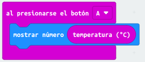
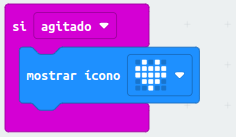

ACTIVIDAD 1:

- En nuestra primera actividad vamos a hacer que la placa muestre una cara feliz al pulsar el botón A, y una cara triste al pulsar el botón B. Para ello te sugerimos seguir las siguientes indicaciones:

- [Enlace1](microbit-Modulo1_Ejercicio1.hex)

ACTIVIDAD 2: 

- En esta actividad vamos a utilizar el sensor de temperatura para mostrar sus valores en la pantalla al presionar los botones A y B. Para ello te sugerimos seguir las siguientes indicaciones:

- [Enlace2](microbit-Modulo1_Ejercicio2.hex)

ACTIVIDAD 3:

- Diseña tu propio programa para que la Micro:bit muestre en la pantalla un icono si es agitado. Para ello te sugerimos seguir las siguientes indicaciones:

- [Enlace3](microbit-Modulo1_Ejercicio3.hex)
