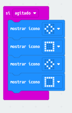
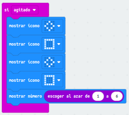
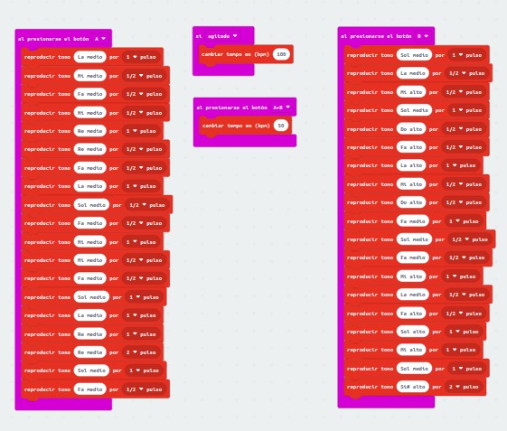

ACTIVIDAD 1:
- A continuación, detallamos los pasos a seguir para que la placa muestre un
cuadrado al agitar la placa:

- [Enlace1](microbit-Modulo2_Ejercicio1.hex)

ACTIVIDAD 2: 
- A continuación, detallamos los pasos a seguir para ampliar la programación y
convertir nuestra animación en un dado. 

- [Enlace2](microbit-Modulo2_Ejercicio2.hex)

ACTIVIDAD 3: 
- Como último ejercicio, se nos pide que toquemos en la placa la primera parte de
una melodía al presionar el botón A.

- [Enlace3](microbit-Modulo2_Ejercicio3.hex)
