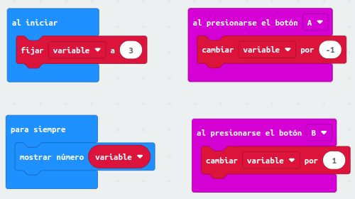
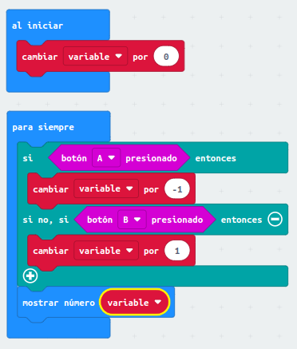
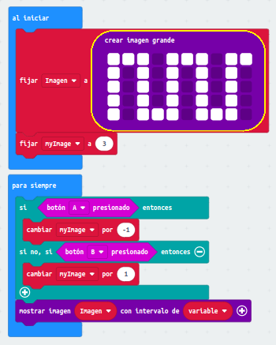

ACTIVIDAD 1: 
- Para crea una variable y programar la placa Micro:bit para que, al presionar el
botón B, la variable aumente y, al presionar el botón A, la variable disminuya

- [Enlace1](microbit-Modulo3_Ejercicio1.hex)

ACTIVIDAD 2: 
- Para hacer que el cambio de la variable sea continuo, lo incluimos en el bloque
“para siempre” con una condición: si el botón A está presionado, cambiamos la
variable en -1. De igual modo, si el botón B está presionado, cambiamos la variable
en 1 unidad. En caso contrario, no modificamos la variable
 
 

- [Enlace2](microbit-Modulo3_Ejercicio2.hex)

ACTIVIDAD 3:
- Para crear una imagen grande y programar la placa para que inicialmente se
muestre la parte central de la imagen y, al presionar los botones A y B, la imagen
se deslice a la izquierda o a la derecha, respectivamente

- [Enlace3](microbit-Modulo3_Ejercicio3.hex)
